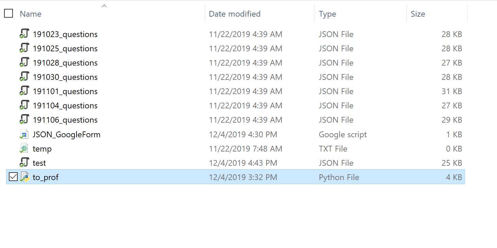
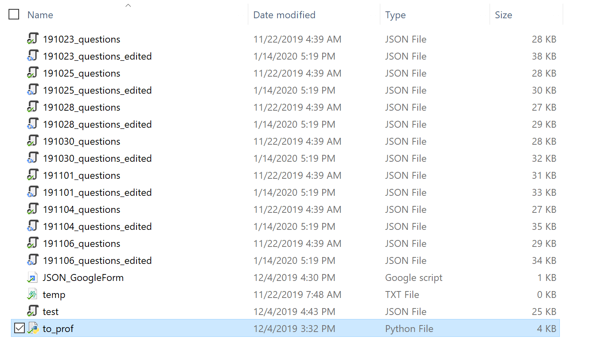

# Setting up and using code to create google quizzes
## Overview
This program works in 2 parts.  
Part 1 -> Simplify original JSON into a JSON file that could work with Canvas in the future 
Part 2 -> Convert the simplified JSON file(s) into a google quiz 
Part 1 is accomplished with the python file "to_prof.py" and can be run as it is. Part 2 is acheived with the JSON_GoogleForm.txt file and requires some setting up to get it working. Fear not, for I will explain the set up here. Once set up, it will become really really easy to use
 
## Step 1: Using Python file
The first step is to convert the initial JSON files that you sent me into a simplified version. 
To do this simply download the "to_prof.py" file into the same folder where you store the json files that you want turned into quizes. 
You should be able to just double click on the python file, and it will generate a copy of all the json files with "_edited" in the file title. if double clicking doesn't work -> Use terminal to go to the folder where the python file is and type "python to_prof.py" in the command line and run it from there (Note: you may have to install some libraries, I will preapre a setup.py file to make this easier in the future)
  
Before running python script 
After running python script
 
## Setting up Google Drive to use Quiz Generator
## Using the Google App Script file
## Reccomendations to making things easier
## Changes to be worked on
- [ ] make a setup.py file for library installs
- [ ] Integrate json generator into google app script
- [ ] Figure out how to get google app script to do multiple at once (maybe run in parallel)
- [ ] Talk to 4 help, and get quizes onto canvas -> no need for google app script
